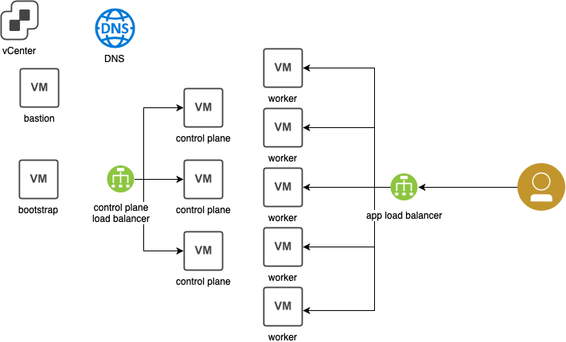

# terraform-ocp4-vmware-example
Terraform to provision Openshift 4.x in VMware VMs using User Provided Infrastructure (UPI)

In this example we provisioned Openshift 4.x in VMware using modular approach.
Two load balancers are provisioned using the [HAProxy Load Balancer](https://github.com/ncolon/terraform-ocp4-lb-haproxy-vmware) module

Supporting Infrastructure (Bastion, DNS Server) is privisioned using the [VMWare OCP4 Supporting Infrastructure](https://github.com/ncolon/terraform-ocp4-supportinfra-vmware) for internal cluster name resolution, and records are created using the [DDNS update](https://github.com/ncolon/terraform-ocp4-dnsregister) module.  

In non-PoC and non-test scenarios, these two modules may be swapped out for manual or automated procedures that configure an external load balancer or DNS server, respectively.  Specifically, DNS update may be swapped out for [DNS zonefile](https://github.com/ibm-cloud-architecture/terraform-dns-zonefile) module for manual import, for example.

## Architecture

Openshift 4.x using User-provided infrastructure



Openshift 4 has a unique bootstrap process where a bootstrap VM is initially created with a machine config server hosting the bootstrap ignition configurations for the rest of the cluster.  Our terraform procedure roughly works like:

1. bastion node created, which contains a small webserver (httpd).  Base Ignition files are generated for each node type (bootstrap, master/control plane, and worker) and served through by the webserver.  These ignition files embed the initial TLS certs used to bootstrap kubelets into the Openshift cluster.
2. control plane load balancer created in a VM forwarding traffic on port `6443` (Openshift API) and `22623` (machine config server) to the bootstrap and all control plane VMs
3. DNS entries are created for each node (A and PTR records), and also DNS entries for the API server, etcd, and SRV records are created.
4. The bootstrap node is created, with an ignition file in the vApp properties that configures a static IP and hostname pointing at the bastion node to retrieve the rest of the cluster.  The bootstrap node starts the machine config server on port `22623`.
5. The control plane nodes are also created with static IPs and hostnames pointing at the bastion node to get the rest of the control plane ignition.  That ignition points it at the control plane load balancer on port `22623`, or the machine config server that the bootstrap node starts up.
6. The control plane receive their ignition files from the machine config server and start an etcd cluster.
7. The bootstrap nodes start up the Openshift API components that connect to the etcd cluster started on the control plane nodes.
8. The bootstrap node provisions the cluster version operator that provisions the rest of the components in the Openshift cluster.
9. The control plane  and worker nodes add themselves to the Openshift cluster and start up the Openshift API components.
10. The bootstrap node shuts down the Openshift API components, as the control plane and worker node continue on as an Openshift cluster.

Once the bootstrap node shuts down the API components, it can be removed from the load balancer and deleted.

## Prerequisites 

1. RedHat CoreOS OVA is required, import into vSphere from [here](https://mirror.openshift.com/pub/openshift-v4/dependencies/rhcos/4.1/latest/rhcos-4.1.0-x86_64-vmware.ova).  [Import into vSphere](https://blog.openshift.com/deploying-a-user-provisioned-infrastructure-environment-for-openshift-4-1-on-vsphere/) and converted to template.
2. A RHEL template used for bastion VM, and haproxy load-balancer.  These templates should have a valid subscription to RHEL.
3. Existing DHCP Server to provide temporary network configuration for the CoreOS nodes.
4. Openshift pull secret, saved as a json file, from [here](https://cloud.redhat.com/openshift/install).

## Variables

|Variable Name|Description|Default Value|Type|
|-------------|-----------|-------------|-------------|
|vsphere_server|vSphere Server FQDN/IP Address|-|string|
|vsphere_cluster|vSphere Cluter|-|string|
|vsphere_datacenter|vSphere Datacenter|-|string|
|vsphere_resource_pool|vSphere Resource Pool|-|string|
|network_label|Name of Network for OCP Nodes|-|string|
|public_network_label|Name of Network to place HAProxy LBs|-|string|
|datastore|vSphere Datastore to deploy to. specify one of `datastore` or `datastore_cluster`|-|string|
|datastore_cluster|vSphere Datastore clusterto deploy to. specify one of `datastore` or `datastore_cluster`|-|string|
|rhcos_template|vSphere Template to use for RHCOS for OpenShift nodes|-|string|
|rhel_template|vSphere Template to use for RHEL (HAProxy LBs and Installer node)|-|string|
|folder|vSphere Folder to put all VMs under|-|string|
|name|Name of cluster, which affects VM naming.  this also ends up being the subdomain of the cluster (i.e. all `<name>`.`<domain>` is the cluster domain|-|string|
|domain|Base Domain.|-|string|
|bastion_private_ip|Private IP address for bastion|-|list|
|bastion_public_ip|Public IP address for bastion|-|list|
|dns_private_ip|Private IP address for DNS server|-|list|
|dns_public_ip|Public IP address for DNS server|-|list|
|externallb_private_ip|Private IP address for External LB|-|list|
|externallb_public_ip|Public IP address for External LB|-|list|
|externallb_private_ip|Private IP address for DNS server|-|list|
|externallb_private_ip|Public IP address for DNS server|-|list|
|bootstrap_ip_address|IP address for bootstrap node|-|list|
|control_plane_ip_addresses|IP address for control plane nodes, a list, must specify same number as `control_plane["count"]`|-|list|
|worker_ip_addresses|IP address for worker nodes, must specify same number as `worker["count"]`|-|list|
|public_dns_servers|list of DNS servers for all VMs.  Used as forwarders to your private DNS server.|-|list|
|ssh_user|SSH user.  Must have passwordless sudo access|-|string|
|ssh_password|Password for `ssh_user`.  Only used here to copy ssh keys to vms|-|string|
|bastion|A map variable for configuration of Bastion node|See sample variables.tf|map|
|bootstrap|A map variable for configuration of Bootstrap node|See sample variables.tf|map|
|control_plane|A map variable for configuration of Control Plane nodes|See sample variables.tf|map|
|worker|A map variable for configuration of Worker nodes|See sample variables.tf|map|
|boot_disk|A map variable for configuration of boot disk for all openshift nodes|See sample variables.tf|map|
|additional_disk|A map variable for configuration of additional disk for OpenShift worker nodes|See sample variables.tf|map|
|dns_key_name_internal|For DDNS update|-|string|
|dns_key_name_external|For DDNS update|-|string|
|dns_key_algorithm|For DDNS update|-|string|
|dns_key_secret_internal|For DDNS update|-|string|
|dns_key_secret_external|For DDNS update|-|string|
|dns_record_ttl|For DDNS update|-|string|
|openshift_pull_secret|Filename of json contents of openshift pull secret|-|string|
|cluster_network_cidr|Pod network address space|`10.254.0.0/16`|string|
|service_network_cidr|Service network address space|`172.30.0.0/16`|string|
|host_prefix|Subnet length for pod network on each host|`24`|string|

## `terraform.tfvars` example

```terraform
#######################################
##### vSphere Access Credentials ######
#######################################
vsphere_server = "vcsa67.rtp.raleigh.ibm.com"

# Set username/password as environment variables VSPHERE_USER and VSPHERE_PASSWORD
ssh_user                     = "virtuser"
ssh_password                 = "passw0rd"
ssh_private_key_file         = "~/.ssh/openshift_rsa"
ssh_public_key_file          = "~/.ssh/openshift_rsa.pub"
bastion_ssh_private_key_file = "~/.ssh/openshift_rsa"
##############################################
##### vSphere deployment specifications ######
##############################################
# Following resources must exist in vSphere
vsphere_datacenter    = "dc01"
vsphere_cluster       = "cluster01"
vsphere_resource_pool = "ncolon"
datastore_cluster     = "dc01-ocp-cluster"
rhel_template         = "rhel-7.6-template-32gb"
rhcos_template        = "rhcos-41"

# Folder to provision the new VMs in, does not need to exist in vSphere
folder = "ncolon-ocp4"

# MUST consist of only lower case alphanumeric characters and '-'
hostname_prefix = "ncolon-ocp4"
cluster_name    = "ncolon-ocp4"

rhn_username = "<RHN_USERNAME>"
rhn_password = "<RHN_PASSWORD>"
rhn_poolid   = "<RHN_POOLID>"

##### Network #####
private_network_label = "vdpg-192.168.100"
private_netmask       = "24"
private_gateway       = "192.168.100.1"
private_domain        = "internal-network.local"

public_network_label = "vDPortGroup"
public_netmask       = "25"
public_gateway       = "9.42.67.129"
public_domain        = "ncolon.xyz"
public_dns_servers   = ["9.42.106.2", "9.42.106.3"]

bastion_private_ip       = ["192.168.100.201"]
bastion_public_ip        = ["9.42.67.175"]
dns_private_ip           = ["192.168.100.202"]
dns_public_ip            = ["9.42.67.176"]
externallb_private_ip    = ["192.168.100.203"]
externallb_public_ip     = ["9.42.67.177"]
internallb_private_ip    = ["192.168.100.204"]
internallb_public_ip     = ["9.42.67.178"]
bootstrap_ip_address     = ["192.168.100.205"]
control_plane_private_ip = ["192.168.100.206", "192.168.100.207", "192.168.100.208"]
worker_ip_address        = ["192.168.100.209", "192.168.100.210", "192.168.100.211"]

dns_key_name_internal   = "rndc-key-internal"
dns_key_name_external   = "rndc-key-external"
dns_key_algorithm       = "hmac-md5"
dns_key_secret_internal = "<DNS_KEY_SECRET_INTERNAL>"
dns_key_secret_external = "<DNS_KEY_SECRET_EXTERNAL>"
dns_record_ttl          = 300

```

